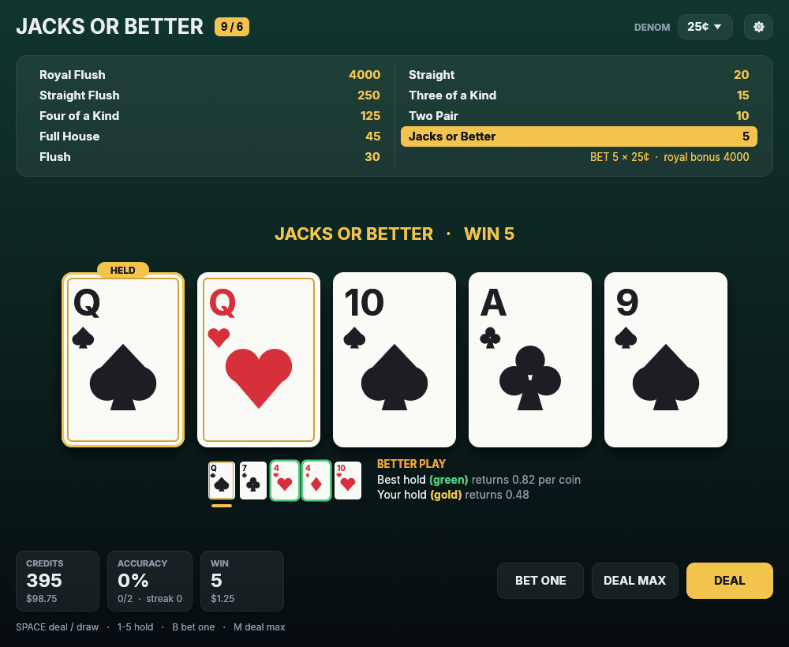

# Jacks or Better

A 9/6 Jacks or Better video poker trainer. Every hold is graded against the mathematically optimal play, computed exactly by enumerating all possible draws.



## Features

- Full-pay 9/6 paytable (99.54% return with perfect play), 1 to 5 coins, 1¢ to $1 denominations
- Strategy feedback after every hand: the dealt hand with the best hold and yours marked, and the expected return of each
- Accuracy and streak tracking, saved between sessions
- Keyboard-driven, with sound, adjustable animation speed and screen reader support

## Download

Grab the latest build for Windows, macOS or Linux from [Releases](https://github.com/0xv1n/jacks-or-better/releases).

The builds are unsigned, so Windows SmartScreen and macOS Gatekeeper will warn on first launch. On macOS, right-click the app and choose Open.

## Controls

| Key | Action |
| --- | --- |
| Space | Deal / draw |
| 1-5 | Hold or release a card |
| B | Bet one more coin (cycles 1 to 5) |
| M | Bet 5 coins and deal |

Cards can also be clicked to hold them.

## Building

Requires stable Rust.

```sh
cargo run --release
```

On Linux, install the windowing and audio libraries first (Debian/Ubuntu):

```sh
sudo apt-get install libxcb-render0-dev libxcb-shape0-dev libxcb-xfixes0-dev libxkbcommon-dev libwayland-dev libasound2-dev
```

## License

MIT. The bundled [Inter](https://rsms.me/inter/) font is under the SIL Open Font License (`assets/fonts/LICENSE-Inter.txt`).
